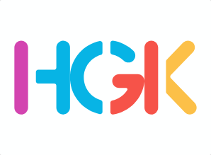

<a id="readme-top"></a>

<!-- PROJECT SHIELDS -->
[![Contributors][contributors-shield]][contributors-url]
[![Forks][forks-shield]][forks-url]
[![Stargazers][stars-shield]][stars-url]
[![Issues][issues-shield]][issues-url]
[![MIT License][license-shield]][license-url]

<!-- PROJECT LOGO -->
<br />
<div align="center">
  <a href="https://github.com/kyurem39/hgk-toys">
    
  </a>

  <h3 align="center">HGK Toys</h3>

  <p align="center">
    Website bán đồ chơi trẻ em, đồ chơi thông minh và mô hình lắp ráp.
    <br />
    <a href="https://github.com/kyurem39/hgk-toys"><strong>Khám phá tài liệu »</strong></a>
    <br />
    <br />
    <a href="https://github.com/kyurem39/hgk-toys">Xem Demo</a>
    &middot;
    <a href="https://github.com/kyurem39/hgk-toys/issues/new?labels=bug">Báo lỗi</a>
    &middot;
    <a href="https://github.com/kyurem39/hgk-toys/issues/new?labels=enhancement">Đề xuất tính năng</a>
  </p>
</div>

<!-- TABLE OF CONTENTS -->
<details>
  <summary>Mục lục</summary>
  <ol>
    <li>
      <a href="#về-dự-án">Về dự án</a>
      <ul>
        <li><a href="#công-nghệ-sử-dụng">Công nghệ sử dụng</a></li>
      </ul>
    </li>
    <li>
      <a href="#hướng-dẫn-cài-đặt">Hướng dẫn cài đặt</a>
      <ul>
        <li><a href="#yêu-cầu-hệ-thống">Yêu cầu hệ thống</a></li>
        <li><a href="#các-bước-thiết-lập">Các bước thiết lập</a></li>
      </ul>
    </li>
    <li><a href="#hướng-dẫn-sử-dụng">Hướng dẫn sử dụng</a></li>
    <li><a href="#tài-khoản-thử-nghiệm">Tài khoản thử nghiệm</a></li>
    <li><a href="#quy-trình-đóng-góp">Quy trình đóng góp</a></li>
    <li><a href="#giấy-phép">Giấy phép</a></li>
    <li><a href="#liên-hệ">Liên hệ</a></li>
  </ol>
</details>

<!-- ABOUT THE PROJECT -->
## Về dự án

**HGK Toys** là một ứng dụng web thương mại điện tử chuyên cung cấp các mặt hàng đồ chơi trẻ em chất lượng cao. Dự án được phát triển dưới dạng đồ án môn học Phát triển ứng dụng Web, tích hợp đầy đủ quy trình từ quản lý sản phẩm, giỏ hàng, đặt hàng cho đến thống kê doanh thu và quản trị hệ thống.

Một số tính năng nổi bật:
* Giao diện trực quan, tương thích đa thiết bị.
* Cơ chế phân quyền chặt chẽ giữa khách hàng, nhân viên bán hàng và quản trị viên.
* Hệ thống tìm kiếm nâng cao sử dụng Stored Procedures tối ưu hiệu suất truy vấn.

<p align="right">(<a href="#readme-top">về đầu trang</a>)</p>

### Công nghệ sử dụng

Dự án được xây dựng bằng cách kết hợp các công nghệ sau:

* [![C#][csharp-badge]][csharp-url]
* [![ASP.NET MVC][aspnet-badge]][aspnet-url]
* [![SQL Server][sqlserver-badge]][sqlserver-url]
* [![Bootstrap][bootstrap-badge]][bootstrap-url]
* [![jQuery][jquery-badge]][jquery-url]

<p align="right">(<a href="#readme-top">về đầu trang</a>)</p>

<!-- GETTING STARTED -->
## Hướng dẫn cài đặt

Để khởi chạy dự án cục bộ trên máy tính của bạn, hãy thực hiện theo các bước hướng dẫn dưới đây.

### Yêu cầu hệ thống

Trước khi cài đặt, hãy đảm bảo máy tính của bạn đã cài đặt các phần mềm sau:
* **Visual Studio 2019 / 2022** (đã chọn gói tải *.NET desktop development* và *ASP.NET and web development*).
* **Microsoft SQL Server** (bản Express hoặc Developer) & **SQL Server Management Studio (SSMS)**.
* **.NET Framework 4.7.2 SDK** (thường đi kèm khi cài đặt Visual Studio).

### Các bước thiết lập

1. **Tải mã nguồn về máy:**
   ```bash
   git clone https://github.com/kyurem39/hgk-toys.git
   cd hgk-toys
   ```

2. **Khởi tạo Cơ sở dữ liệu:**
   - Mở phần mềm SQL Server Management Studio (SSMS).
   - Mở file script `Project_64130980.sql` nằm ở thư mục gốc của dự án.
   - Nhấn **Execute (F5)** để khởi chạy script tạo database `Project_64130980` cùng toàn bộ bảng, dữ liệu mẫu và các procedure.

3. **Cấu hình kết nối cơ sở dữ liệu:**
   - Mở file `Project_64130980/Web.config`.
   - Tìm thẻ `<connectionStrings>` ở cuối file.
   - Cập nhật thông số `data source` thành tên SQL Server Instance của bạn:
     ```xml
     connectionString="...data source=TÊN_SERVER_CỦA_BẠN;initial catalog=Project_64130980;integrated security=True;..."
     ```

4. **Khởi chạy ứng dụng:**
   - Mở file solution `Project_64130980.sln` bằng Visual Studio.
   - Chuột phải vào project `Project_64130980` và chọn **Set as Startup Project**.
   - Nhấn **Ctrl + F5** hoặc **F5** để khởi chạy ứng dụng trực tiếp trên trình duyệt qua IIS Express.

<p align="right">(<a href="#readme-top">về đầu trang</a>)</p>

<!-- USAGE EXAMPLES -->
## Hướng dẫn sử dụng

Hệ thống cung cấp hai khu vực giao diện chính:
* **Khu vực công cộng (Storefront):** Khách hàng có thể duyệt danh mục sản phẩm, tìm kiếm đồ chơi theo tên/giá/loại, thêm sản phẩm vào giỏ hàng và tiến hành đặt hàng trực tuyến.
* **Khu vực quản trị (Backoffice):** Nhân viên và Quản trị viên truy cập thông qua chức năng đăng nhập để thực hiện quản lý kho hàng, duyệt hóa đơn đặt hàng của khách, thống kê doanh số bán hàng theo ngày/tháng/năm.

<p align="right">(<a href="#readme-top">về đầu trang</a>)</p>

<!-- ACCOUNTS -->
## Tài khoản thử nghiệm

Dữ liệu mẫu đi kèm cung cấp các tài khoản thử nghiệm sau để bạn dễ dàng kiểm thử các quyền hạn khác nhau:

### 1. Tài khoản nhân viên (Quyền quản lý đơn hàng/sản phẩm)
* **Email:** `nguyenve@gmail.com`
* **Mật khẩu:** `123`

### 2. Tài khoản quản trị viên (Quyền toàn hệ thống)
* **Email:** `vungh@gmail.com`
* **Mật khẩu:** `123`

### 3. Tài khoản khách hàng
* **Email:** `nguyenvana@gmail.com`
* **Mật khẩu:** *(Đăng nhập thông qua tài khoản khách hàng thông thường)*

<p align="right">(<a href="#readme-top">về đầu trang</a>)</p>

<!-- CONTRIBUTING -->
## Quy trình đóng góp

Mọi đóng góp giúp dự án hoàn thiện hơn đều được trân trọng. Bạn có thể đóng góp theo quy trình sau:

1. Fork dự án này.
2. Tạo nhánh tính năng mới của bạn (`git checkout -b feature/AmazingFeature`).
3. Commit các thay đổi (`git commit -m 'Add some AmazingFeature'`).
4. Push nhánh tính năng lên GitHub (`git push origin feature/AmazingFeature`).
5. Tạo một Pull Request mới để thảo luận và gộp mã nguồn.

<p align="right">(<a href="#readme-top">về đầu trang</a>)</p>

<!-- LICENSE -->
## Giấy phép

Phân phối dưới giấy phép MIT. Xem thêm tệp `LICENSE` để biết thêm chi tiết.

<p align="right">(<a href="#readme-top">về đầu trang</a>)</p>

<!-- CONTACT -->
## Liên hệ

Hoàng Gia Khánh - 64130980 - khanhpe39@gmail.com

Link dự án: [https://github.com/kyurem39/hgk-toys](https://github.com/kyurem39/hgk-toys)

<p align="right">(<a href="#readme-top">về đầu trang</a>)</p>

<!-- MARKDOWN LINKS & IMAGES -->
[contributors-shield]: https://img.shields.io/github/contributors/kyurem39/hgk-toys.svg?style=for-the-badge
[contributors-url]: https://github.com/kyurem39/hgk-toys/graphs/contributors
[forks-shield]: https://img.shields.io/github/forks/kyurem39/hgk-toys.svg?style=for-the-badge
[forks-url]: https://github.com/kyurem39/hgk-toys/network/members
[stars-shield]: https://img.shields.io/github/stars/kyurem39/hgk-toys.svg?style=for-the-badge
[stars-url]: https://github.com/kyurem39/hgk-toys/stargazers
[issues-shield]: https://img.shields.io/github/issues/kyurem39/hgk-toys.svg?style=for-the-badge
[issues-url]: https://github.com/kyurem39/hgk-toys/issues
[license-shield]: https://img.shields.io/github/license/kyurem39/hgk-toys.svg?style=for-the-badge
[license-url]: https://github.com/kyurem39/hgk-toys/blob/master/LICENSE
[csharp-badge]: https://img.shields.io/badge/c%23-%23239120.svg?style=for-the-badge&logo=csharp&logoColor=white
[csharp-url]: https://docs.microsoft.com/en-us/dotnet/csharp/
[aspnet-badge]: https://img.shields.io/badge/ASP.NET_MVC-512BD4?style=for-the-badge&logo=microsoft&logoColor=white
[aspnet-url]: https://dotnet.microsoft.com/apps/aspnet/mvc
[sqlserver-badge]: https://img.shields.io/badge/Microsoft%20SQL%20Server-CC2927?style=for-the-badge&logo=microsoft-sql-server&logoColor=white
[sqlserver-url]: https://www.microsoft.com/en-us/sql-server/
[bootstrap-badge]: https://img.shields.io/badge/bootstrap-%238511FA.svg?style=for-the-badge&logo=bootstrap&logoColor=white
[bootstrap-url]: https://getbootstrap.com/
[jquery-badge]: https://img.shields.io/badge/jquery-%230769AD.svg?style=for-the-badge&logo=jquery&logoColor=white
[jquery-url]: https://jquery.com/
